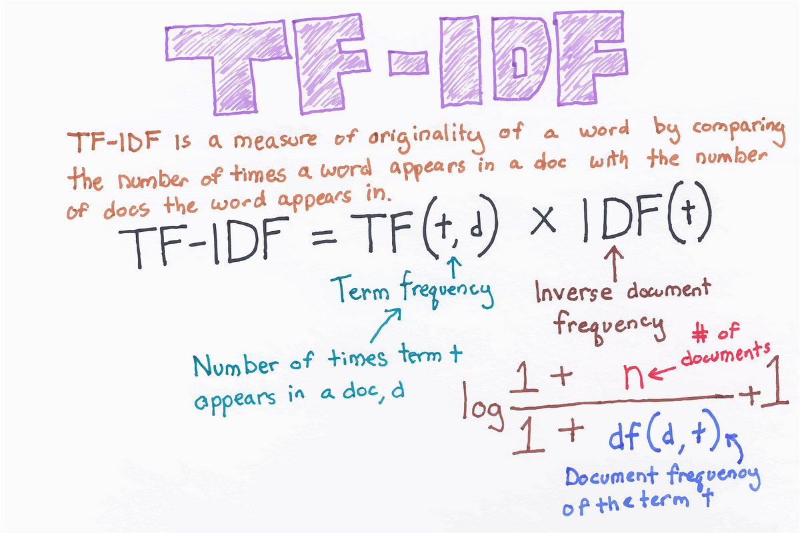
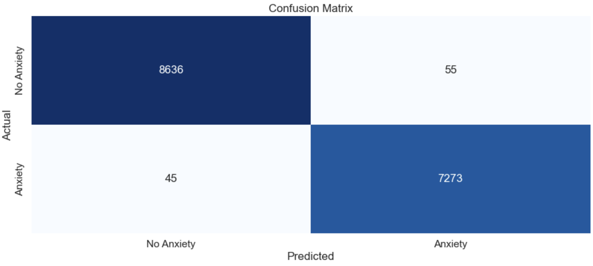
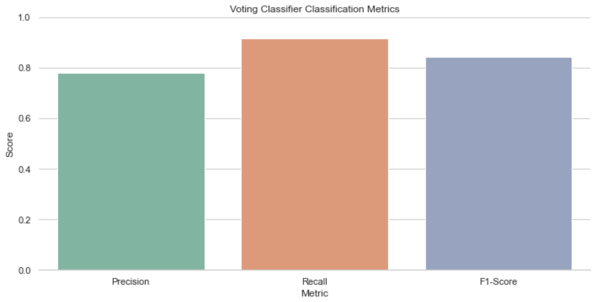
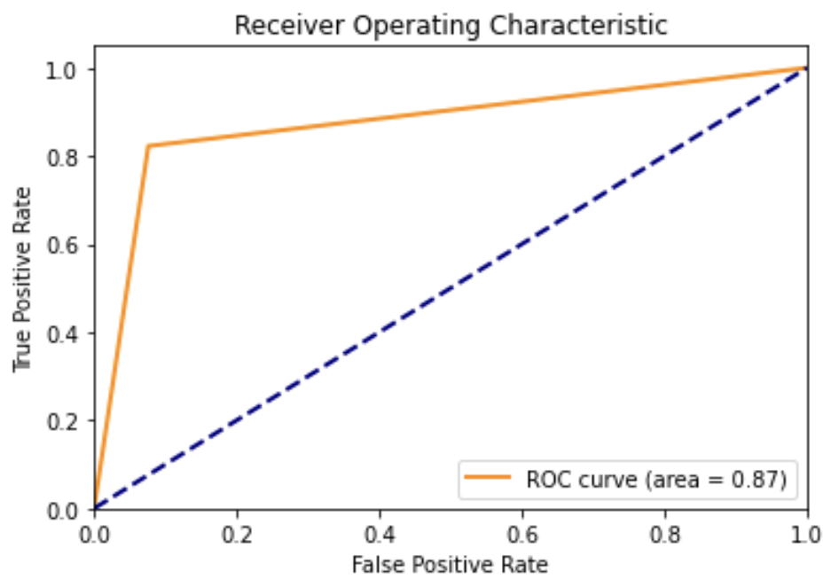

# 🧠 Mental Health Tweet Classification Using Advanced NLP Techniques

## 🧩 Overview

With the exponential rise of social media platforms like Twitter, individuals frequently express their emotional states and mental well-being in short bursts of text. While this presents challenges due to informal language, sarcasm, and brevity, it also offers an unprecedented opportunity to identify early signals of mental health conditions through scalable AI solutions.

This project applies **advanced Natural Language Processing (NLP)** and **multi-output machine learning** to classify tweets that exhibit signs of:
- **Depression**
- **Anxiety**
- **Suicidal ideation**

Our final model is capable of **simultaneous multi-label prediction**, enabling detection of overlapping conditions in a single tweet.

---

## 🚀 Objectives

- Automatically classify tweets into one or more mental health risk categories
- Explore and compare **binary classifiers** vs. **multi-output models**
- Build a pipeline that transforms raw, noisy tweet data into structured insights
- Serve as a foundational prototype for mental health analysis in digital spaces

---

## 🧪 Technical Highlights
This project uses cutting-edge NLP workflows built with open-source libraries and scikit-learn. The key stages include:

---

### 🔤 Text Preprocessing

Each tweet goes through a robust preprocessing pipeline to transform unstructured text into clean input for machine learning models:

- Lowercasing all text
- Removing:
  - URLs (`http://...`)
  - Mentions (`@username`)
  - Emojis and hashtags (optional)
  - Punctuation and numeric tokens
- Tokenization using `nltk.word_tokenize`
- Stopword removal with NLTK's predefined corpus
- **Stemming** via `PorterStemmer` to normalize inflections (e.g. "crying" → "cry")

---

### 📈 Feature Engineering

To represent text numerically:

- **TF-IDF Vectorization**:
  
  - Captures importance of words in each tweet relative to the full dataset
  - Uses **unigrams and bigrams** (`ngram_range=(1,2)`)
  - Removes English stopwords (`stop_words='english'`)
  - Reduces overfitting by limiting vocabulary size (`max_features=5000`)
---

---
- **CountVectorizer**:
  
  - Used in comparative experiments for traditional bag-of-words modeling
  
---

### 🤖 Model Architectures

The project builds four classifiers:

```yaml
1. Depression Classifier: Logistic Regression (Binary)
2. Anxiety Classifier:     Logistic Regression (Binary)
3. Suicide Classifier:     Logistic Regression (Binary)
4. Multi-output Classifier:
     - Model: RandomForestClassifier
     - Wrapper: MultiOutputClassifier
     - Output: Predicts all 3 mental health states simultaneously
```

## 📊 Model Evaluation
---

---

Each classifier is evaluated using scikit-learn’s classification_report(), providing a detailed breakdown of:
- Precision
- Recall
- F1-score



---

## ✅ Binary Classifiers :

- Performance is assessed per class (positive/negative) to account for class imbalance.
- The focus is not only on overall accuracy, but also on true positive detection—crucial in mental health classification.

In addition to standard metrics, ROC (Receiver Operating Characteristic) curves are plotted to visualize the trade-off between True Positive Rate (Sensitivity) and False Positive Rate.
AUC (Area Under the Curve) scores are computed for each classifier, offering a single scalar value to summarize model performance—where a score closer to 1.0 indicates stronger discriminative power.



---

## 🔁 Multi-output Model

The multi-label model (RandomForest + MultiOutputClassifier) evaluates each label independently.

Classification metrics are generated for:
- Depression
- Anxiety
- Suicidal ideation
This allows fine-grained performance analysis across all three conditions.

⚠️ Evaluation metrics ensure that the model is not just accurate, but also sensitive to rare but critical positive cases, which is essential for early mental health detection.

---

## 💾 Model Exportation :

All final models can be saved using `pickle` or `joblib` for inference later
- `The multi_output_rf.pkl` file contains the trained multi-output Random Forest model

---

## 📬 Contact :

- Youssef Benaouda, Freelancer in AI
- Mail : benaoudayoussef123@gmail.com
- Active on LinkedIn
